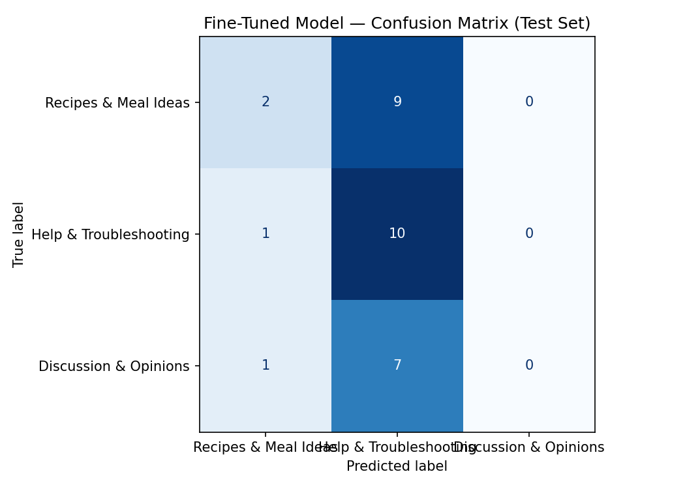

# ai201-project3-takemeter
AI201 Project 3 - Text Classifier

## Project Overview

This project fine tunes a DistilBERT model to classify Reddit posts from cooking related communities into one of three categories based on the main purpose of each post. A dataset of 200 manually labeled Reddit posts was created and used to train the model. The fine tuned model was then compared with a zero shot baseline using Groq's Llama 3.3 70B model.

## Demo : https://screenpal.com/content/video/cOiV1UnUQZ0 

---

# Dataset

## Data Source

The dataset was manually collected from cooking related Reddit communities including:

* r/Cooking
* r/AskCulinary
* r/Baking

Only cooking related posts were included.

A total of **200 Reddit posts** were manually labeled.

---

# Label Taxonomy

## Recipes and Meal Ideas

**Definition**

Posts asking for recipes, meal ideas, ingredient ideas, or suggestions about what to cook. The goal is to find ideas for making food instead of solving a cooking problem.

**Example Posts**

* What can I make with leftover chicken?
* Easy dinner ideas for beginners?

---

## Help and Troubleshooting

**Definition**

Posts asking how to fix cooking or baking problems, ingredient substitutions, storage questions, food safety, cooking techniques, or equipment issues.

**Example Posts**

* Why are my cookies flat?
* How do I de clump a sauce?

---

## Discussion and Opinions

**Definition**

Posts asking for opinions, recommendations, experiences, preferences, or general discussion related to cooking.

**Example Posts**

* What is the best cooking advice you have received?
* Cooking every day is a hassle.

---

# Dataset Statistics

Total examples:

**200**

Dataset split:

| Dataset | Examples |
|---------|---------:|
| Training | 140 |
| Validation | 30 |
| Test | 30 |

Label distribution:

| Label | Count |
|--------|------:|
| Recipes and Meal Ideas | 71 |
| Help and Troubleshooting | 73 |
| Discussion and Opinions | 56 |

No label represents more than 70% of the dataset.

---

# Labeling Process

Each Reddit post was manually reviewed and assigned one label based on the main purpose of the post.

The following rules were used:

* Recipe requests, meal ideas, and ingredient ideas were labeled **Recipes and Meal Ideas**.
* Cooking problems, substitutions, storage, food safety, and cooking techniques were labeled **Help and Troubleshooting**.
* Opinions, recommendations, experiences, and general discussion were labeled **Discussion and Opinions**.

---

# Difficult Examples

## Example 1

**Post**

Almond extract alternatives

**Decision**

Recipes and Meal Ideas

**Reason**

Ingredient substitutions could reasonably fit either recipe requests or troubleshooting.

---

## Example 2

**Post**

Help with an old family recipe

**Decision**

Help and Troubleshooting

**Reason**

Although the title mentions a recipe, the user is mainly asking for help solving a cooking problem.

---

## Example 3

**Post**

Prison "Spread" Recipe

**Decision**

Recipes and Meal Ideas

**Reason**

Without additional context, the title could also be interpreted as a discussion post.

---

# Fine Tuning Pipeline

## Base Model

distilbert base uncased

## Training Platform

Google Colab using the Hugging Face Transformers library.

## Training Decisions

The notebook originally used:

* 3 epochs
* 50 warmup steps

The first model achieved only **23.3%** accuracy on the test set.

To improve performance, the number of epochs was increased to **5** and the warmup steps were reduced to **10**.

These changes increased the final test accuracy to **50.0%**.

Final hyperparameters:

* Epochs: 5
* Learning rate: 2e 5
* Batch size: 16
* Warmup steps: 10
* Weight decay: 0.01

---

# Baseline Comparison

The baseline used Groq's Llama 3.3 70B model.

A prompt defined the three labels, included one example for each category, and instructed the model to return only one label. The same 30 example test set was used for both models.

---

# Evaluation Report

## Overall Accuracy

| Model | Accuracy |
|--------|---------:|
| Groq Llama 3.3 70B | **70.0%** |
| DistilBERT | **50.0%** |

---

## Fine Tuned Model Metrics

| Label | Precision | Recall | F1 Score |
|--------|----------:|-------:|---------:|
| Recipes and Meal Ideas | 0.42 | 0.73 | 0.53 |
| Help and Troubleshooting | 0.62 | 0.45 | 0.53 |
| Discussion and Opinions | 0.67 | 0.25 | 0.36 |

Overall accuracy:

**50.0%**

---

# Confusion Matrix

---

# Error Analysis

## Incorrect Prediction 1

**Post**

Almond extract alternatives

**True Label**

Recipes and Meal Ideas

**Predicted Label**

Help and Troubleshooting

Ingredient substitutions naturally overlap between recipe requests and troubleshooting.

---

## Incorrect Prediction 2

**Post**

Help with an old family recipe

**True Label**

Help and Troubleshooting

**Predicted Label**

Recipes and Meal Ideas

The word "recipe" strongly influenced the model even though the user was asking for help.

---

## Incorrect Prediction 3

**Post**

Bacon wrapped meatloaf hack so I do not get soggy or burnt bacon?

**True Label**

Help and Troubleshooting

**Predicted Label**

Recipes and Meal Ideas

The model recognized the food item but did not recognize that the user wanted help solving a cooking problem.

---

# Reflection

The largest source of error occurred between **Recipes and Meal Ideas** and **Help and Troubleshooting**. Many cooking posts involve ingredient substitutions or recipe modifications that could reasonably belong to either category. Short Reddit titles also made it difficult for the model to determine the author's true intent. Increasing the number of training epochs improved the fine tuned model from **23.3%** accuracy to **50.0%**, although the Groq baseline still achieved better performance.

---

# AI Usage

## AI Use 1

I used ChatGPT to review sections of the training pipeline, and suggest changes to the hyperparameters. After testing different settings, I increased the number of training epochs from 3 to 5 and reduced the warmup steps from 50 to 10. I reran the notebook and verified that these changes improved the model accuracy from 23.3% to 50.0% before keeping them in the final project.

## AI Use 2

I used ChatGPT to help interpret the evaluation results, including the confusion matrix, precision, recall, and F1 score based on project requirements. I reviewed the notebook outputs myself, verified the reported metrics, and fixed the errors when needed.

---

# Specification Reflection

## How the specification helped

The project specification helped define clear label boundaries, required a balanced dataset, and encouraged comparing the fine tuned model with a zero shot baseline.

## Where implementation differed

Some Reddit posts contained only short titles, making the correct label difficult to determine. Although the specification encouraged clear label boundaries, real Reddit data often required manual judgment when choosing between recipe requests and troubleshooting.

---

# Repository Contents

* README.md
* planning.md
* cooking_dataset.csv
* evaluation_results.json
* confusion_matrix.png
* Project3.ipynb
